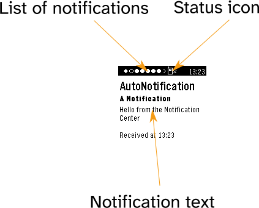

# Notification Center for Pebble

A WIP improved notifications app for the PebbleOS watches

# Install

**Note: Core/Pebble app is only supported from its version 1.0.7.7 onwards**

## Android app

[](https://apps.obtainium.imranr.dev/redirect?r=obtainium://add/https://github.com/matejdro/PebbleNotificationCenter2)
[](../../releases/latest)

## Watchapp

[](../../releases/latest)

# Usage

## On the watch



### Status icons

* Hourglass () - The app is loading data in the background. You can generally keep using the app while this is going on.
* Phone disconnected () - The Watch has been disconnected from the phone. You can stil use the app to read excerpts of the previously-synced notifications, but you cannot execute any actions
* Error (E) - Something has gone wrong. Please make a Github issue with the reproduction steps.

### Notification list indicators

If an indicator is filled with black color, it indicates the currently selected notification.

* Diamond (◆) - Unread noitifcation
* Circle (●) - Read notification
* Right arrow (>) - There are more notifications that way
* Left arrow (<) - There are more notifications that way

### Buttons

* Single click / hold DOWN - Scroll text down (wraps on click)
* Single click / hold UP - Scroll text up (wraps on click)
* Double click UP - Switch to previous notification (wraps around)
* Double click DOWN - Switch to next notification (wraps around)
* Click SELECT - Open actions menu
* Click BACK - Exit

### Why is the app buzzing at me?

#### While attempting to open actions menu

* Double buzz - Either the actions menu is still loading or the phone is disconnected (check the status icon). If former, this usually takes a very short amount of time, so you can usually retry immediately.

#### While triggering a notification action

* Double buzz - Trigger failed. That usually means the phone got disconnected (check the status icon).
* Single buzz - Action triggered successfuly

#### While not pressing anything

* Double buzz - Phone got disconnected from the watch while the app was open (check the status icon).

# Contributing

To contribute to this project:

1. Install [Git LFS](https://git-lfs.com/)
2. Checkout `main`
3. Pull submodules `git submodule update --init --recursive`
4. Run `git lfs fetch` in the repo
5. Create a new branch for your contribution
6. Commit your work. While commiting, use [conventional commits](https://www.conventionalcommits.org/en/v1.0.0/). Scope tag should
   be the name of the module you are updating.
7. Try to avoid breaking changes, but if they cannot be avoided, you must put `BREAKING CHANGE` in the footer of the commit
   mesasage
   and explain the change.
8. Create a merge request
9. After your PR is merged, new release will be generated automatically every day

## Updating versions

Process for updating all library versions::

1. Update Gradle version
    1. Find latest version and the checksum for -all version from https://gradle.org/release-checksums/
       (We use SHA to secure against wrapper attack, see https://blog.gradle.org/wrapper-attack-report)
    2. Run `./gradlew wrapper --gradle-version VERSION --gradle-distribution-sha256-sum SHA`, where you
       substitute `VERSION` and `SHA` with the info found in the previous step.
2. Open `libs.toml` file and check if any versions marked with `@pin` have been unblocked and can now be updated
3. Run `./gradlew versionCatalogUpdate`.
4. Sync the project, build the app and run all tests to make sure everything still works.
5. Run `detektDebug` gradle task to find any new deprecated code
6. For any new deprecated code found by the search:
    * If the fix is trivial, fix it immediately as part of the update commit
    * Otherwise, make a tech debt ticket and add a @Suppress with the ticket number
      (and/or discuss with the team how to address it)

## Creating a new module

To easily add new modules, first enable project templates (you only need to do this once).
Open Android Studio's Settings, go to "File and Code Templates" and set Scheme to "Project".


Then, to create a new module:

1. Right click on the root in the project window, select New and then the project type you want
   
2. Add module to `settings.gradle.kts`
3. Add module to app's `build.gradle.kts` as `implementation(projects.newModule)`)
4. Remove leading space from all generated ` .gitignore` files (workaround for the https://youtrack.jetbrains.com/issue/IJPL-2568)

## Hierarchy of the feature modules

Every feature should contain following modules:

* `feature-name`
    * `data` - data module with all non-UI logic (such as repositories).
      No other `data` or `ui` module should depend on this (except for tests).
    * `api` - interfaces and data models exposed to other modules.
      This module should generally contain no logic to speed up builds.
    * `ui` - Module containing feature's ui (Screens / Fragments / ViewModels).
      No other `data` or `ui` module should depend on this (except for tests).
    * `test` (optional) - Module containing test helpers for faking stuff exposed in the `api` module

If your module contains instrumented tests, you must enable them with the following call:

```kotlin
custom {
   enableEmulatorTests.set(true)
}
```

## Running integration tests

`./gradlew :app:connectedAndroidTest -PtestAppWithProguard`

## Creating screenshot tests

To create screenshot tests for your compose screen:

1. Make preview functions public
2. Add `showkase` plugin to the module of the screen you want to test
2. Add `@ShowkaseComposable(group = "Test")` annotation to the preview of the screen you want to test
