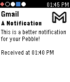
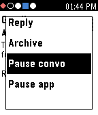
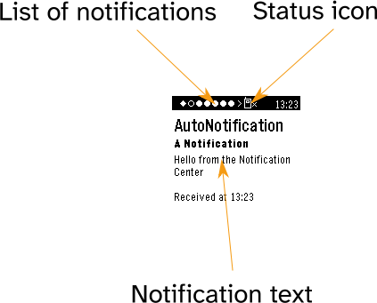

# Notification Center for Pebble

An improved notifications app for the PebbleOS watches

 

# Install

**Note: the old Pebble app is not supported. You have to use either the microPebble or the new Pebble/Core app.**

## Android app

## Watchapp

# Features

#### Full notification sync
Instead of just showing received notification pager-style, NC will show all the notifications from your phone  (within reason).

#### Customizability
Configure every aspect of the notification. Have different settings depending on which app sent the notification or depending on what the notification says.

#### Display icons for all apps
Instead of just a few hardcoded icons in the firmware, NC will display icons for every single notification.

#### Full length text
Display whole notification text instead of just short excerpts.

#### Regex filtering
Filter out notifications saying specific text.

#### Spam control
Pausing system helps with controlling bursty noisy notifications like a group chat with a heated conversation.

#### Snoozing
Don't want to deal with the notification right now? Just snooze it for later (Android 8+ only).

#### Picture display
A friend sent you a picture and you don't want to pull out your phone? You can check it out on your watch.

#### Periodic vibration
Original vibration happened while you were distracted, and you did not notice it? App can keep buzzing for it periodically until you notice it.

#### Offline operation
You can still read excerpts of your notifications while the watch is not connected to the phone.

#### Dynamic phone mute
Don't you hate when your phone also makes noise / vibrate in addition to the watch's vibration? You can have auto-phone-mute that mutes your phone automatically whenever a watch is connected. Also, toggleable directly from the watch.

#### Regex replacement
Want to remove unnecessary text from the message? Want to show SMS one-time-passwords more prominently? You can with regex replacement.

#### Toggle mute via Tasker
Disable/enable Mute via [Tasker](https://tasker.joaoapps.com/) automation tool. Mute your watch automatically based on any rules.

# Usage

## On the watch

<picture>
  <source media="(prefers-color-scheme: dark)" srcset="./docs/guide_dark.png">
  
</picture>

### Status icons

* Hourglass (<picture>
  <source media="(prefers-color-scheme: dark)" srcset="./docs/busy_dark.png">
  </picture>) - The app is loading data in the background. You can generally keep using the app while this is going on.
* Phone disconnected (<picture>
  <source media="(prefers-color-scheme: dark)" srcset="./docs/disconnected_dark.png">
  </picture>) - The Watch has been disconnected from the phone. You can still use the app to read excerpts of the previously-synced notifications, but you cannot execute any actions
* Error (E) - Something has gone wrong. Please make a GitHub issue with the reproduction steps.

### Notification list indicators

If an indicator is filled with black color, it indicates the currently selected notification. 

* Diamond (◆) - Unread notification
* Square (■) - Paused notification (see [Special Actions](#special-actions) below)
* Circle (●) - Read, unpaused notification
* Right arrow (>) - There are more notifications that way
* Left arrow (<) - There are more notifications that way

### Buttons

* Single click / hold DOWN - Scroll text down (wraps on click)
* Single click / hold UP - Scroll text up (wraps on click)
* Double click UP - Switch to previous notification (wraps around)
* Double click DOWN - Switch to next notification (wraps around)
* Click SELECT - Open actions menu
* Double click BACK - Open settings
* Click BACK - Exit

### Why is the app buzzing at me?

#### While attempting to open actions menu

* Double buzz - Either the actions menu is still loading or the phone is disconnected (check the status icon). If former, this usually takes a very short amount of time, so you can usually retry immediately.

#### While triggering a notification action

* Double buzz - Trigger failed. That usually means the phone got disconnected (check the status icon).
* Single buzz - Action triggered successfully

#### While not pressing anything

* Double buzz - Phone got disconnected from the watch while the app was open (check the status icon).
* Single very short buzz - You have periodic vibration enabled

### Special actions

### Pause/Unpause app

When triggered, all vibrations from the app that created this notifications will be temporarily paused.

The watch will not vibrate for any new notifications from this app until it is manually unpaused or until 
all notifications from this app are dismissed.

### Pause/Unpause conversation (convo)

When triggered, all vibrations from the selected conversation will be temporarily paused.

The watch will not vibrate for any new messages in this conversation until it is manually unpaused or dismissed.

### Snooze

By selecting the Snooze action and then selecting the time, notification will "disappear" from your phone & watch and re-appear after the selected time. You will get notified about it again.

Note: only supported on Android 8 and newer.

### Show image

If a notification has an image attached, its subtitle will have a 📷 icon.

In this case, you can select `Show image` action, which will show the image on the watch full-screen

## On the phone

### Mute / Hide an app

If you just want to simply mute or hide a specific application, you do not need to deal with the entire rule system. Just select the + button and then the mute or hide option.

### Default Settings

On the top of the rules list is the `Default Settings` rule. These settings are applied to any notifications before any other custom rules are applied.

### Custom rules

Rules are a primary way to configure notifications in the Notification Center. Rather than a static configuration, they consist of a conditions that determine when a specific rule applies and settings that get applied.

Example rules:

* When a notification comes from the `Work Email` app, mute that notification.
* When a notification comes from the `My Social Media` app and contains the word `Promotion`, hide that notification.
* When a notification comes from the `SMS` app and contains `My Last Name`, but does not contain `My Annoying Cousin's name`, change the vibration pattern to something specific.

#### Conditions

You can currently set up three different conditions for every rule:

* Originating app / channel - Passes when a notification originates from a specific app or a specific notification channel of that app
* Whitelist regex - Passes when a notification title, subtitle or body text contains the specified regular expression
* Blacklist regex - Passes when a notification title, subtitle or body text does not contain the specified regular expression

All conditions are applied using the AND logic - every condition on the rule needs to pass in order for the rule to apply. There is currently no way of performing OR logic, but you can simulate it by creating a copy of the rule.

#### Settings

Every rule has a bunch of settings that you can apply when rule's conditions pass. 

Settings are applied sequentially to all passing rules from top to bottom. You can reorder the rules by drag-dropping them in the rules list to change the order of applying.

# Frequently asked questions (FAQ)

### Why am I getting double notifications?

NC will pop up notifications in addition to the native Pebble notifications. You need to disable native notifications to avoid doubling. You can do that in two ways:

1. In the phone Pebble app, disable notifications
2. On the watch under Settings -> Notifications -> set `Filter` to `Allow phone calls only` (NC does not show phone call notifications, so you want to keep those)

### How can I only show some apps with NC?

By default NC will show all apps, except for those explicitly hidden. You can invert this by:

1. Set `Master switch` in the `Default settings` rule to `Mute`
2. For every app / regex, you want to include, create a new rule, add desired app / regex and set its `Master Switch` to `Show`

### Does NC show phone notifications?

No, NC only shows regular "text" notifications. Phone notifications should still be handled by the Pebble app.

# Contributing

See [CONTRIBUTING](CONTRIBUTING.MD)
